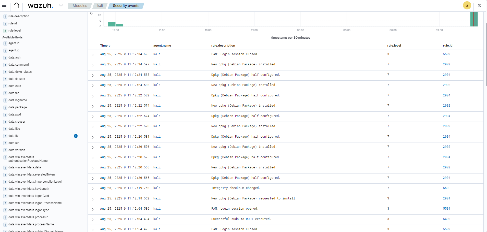

# SOC Lab com Wazuh SIEM

Este projeto é um laboratório prático de cibersegurança criado para simular o trabalho de um Analista de SOC (Security Operations Center) Júnior.  
O objetivo é configurar um ambiente com SIEM para coleta, análise e resposta a incidentes de segurança, utilizando ferramentas open source.

---

## 🎯 Objetivos do Projeto
- Montar um ambiente SOC funcional utilizando **Wazuh SIEM**.
- Simular ataques controlados e gerar eventos de segurança.
- Analisar alertas e criar relatórios de investigação.
- Documentar todo o processo para portfólio profissional.

---

## 🖥️ Estrutura do Laboratório
O projeto utiliza **máquinas virtuais no VirtualBox** com a seguinte arquitetura:

- **Ubuntu Server 22.04 LTS** → Servidor Wazuh + Elasticsearch + Kibana.
- **Windows 10/11** → Endpoint monitorado (agente Wazuh).
- **Kali Linux** → Máquina atacante para simulação de incidentes.

### Configuração do Nome do Host - Windows 10
O nome do computador foi configurado para `WIN10-LAB` para padronização no ambiente do SOC Lab e facilitar a identificação no Wazuh.

### Ubuntu Server com Wazuh Server

### Windows com agente Wazuh

### Kali Linux inicial

---

## 🛠️ Ferramentas Utilizadas
- **VirtualBox** (virtualização)
- **Ubuntu Server** (servidor SIEM)
- **Wazuh** (coleta e análise de logs)
- **Elasticsearch** (armazenamento e busca)
- **Kibana** (visualização de dados)
- **Kali Linux** (ferramentas de teste de invasão)
- **Wireshark** *(opcional)* para análise de pacotes

---

## 📅 Etapas do Projeto
1. Configuração das VMs no VirtualBox.
2. Instalação do Ubuntu Server e configuração de rede.
3. Instalação do Wazuh e serviços associados.
4. Configuração de agentes no Windows.
5. Simulação de incidentes usando Kali Linux.
6. Análise de alertas no SIEM.
7. Documentação e publicação no GitHub.

---

## 🖥️ Painel Inicial do Wazuh

Abaixo está o print do painel inicial do Wazuh após a configuração:

### Agentes Conectados
Após a instalação e configuração, os agentes Windows e Kali aparecem como ativos no Wazuh:

  
> 🔒 Alguns endereços IP foram ocultados propositalmente nos prints por questões de privacidade, mantendo apenas as informações relevantes para demonstração do projeto.

---

### Primeiros eventos coletados no Kali (SSH)
Após a configuração do agente no Kali para monitorar `/var/log/auth.log`, o Wazuh passou a registrar eventos de:
- Tentativas de brute force via SSH.
- Tentativas de login com usuário inexistente.
- Falhas de autenticação.
- Uso de privilégios administrativos (`sudo`).

**Exemplo de eventos capturados no Kali:**  

---

### Primeiros eventos coletados no Windows (RDP/Logon)
Após a configuração do agente no Windows para monitorar eventos de segurança, o Wazuh passou a registrar eventos de:
- Tentativas de login com usuário inexistente.
- Tentativas de login com senha incorreta.
- Falhas de autenticação (Event ID 4625).

**Exemplo de eventos capturados no Windows:**  

### Monitoramento de Integridade de Arquivos (FIM)

Após corrigir a configuração do agente no Kali (remoção de seções duplicadas de `<syscheck>`), o Wazuh passou a registrar alterações em arquivos monitorados.

Foi criado o arquivo `/etc/fim_demo` no Kali e, após modificações, o agente enviou os eventos de **File Integrity Monitoring** para o servidor.  

**Exemplo de eventos capturados no Dashboard:**  

**Detalhes dos eventos:**
- **Agente:** Kali  
- **Arquivo monitorado:** `/etc/fim_demo`  
- **Evento:** modified  
- **Descrição:** Integrity checksum changed.  

> ✅ O módulo **Syscheck** do Wazuh está ativo e funcional, registrando mudanças críticas em diretórios sensíveis.

📄 [Veja o passo a passo completo da configuração](docs/03-simulacoes/03-fim-kali.md)

---

## 🎯 Simulações
- [Cenário 01 — Falhas de login SSH no Kali](docs/03-simulacoes/01-ssh-falhas-kali.md)  
- [Cenário 02 — Falhas de login no Windows](docs/03-simulacoes/02-windows-falhas-login.md)  
- [Cenário 03 — Bloqueio/Desbloqueio de Sessão no Windows (Win+L)](docs/03-simulacoes/03-windows-lock-unlock.md)  
- [Cenário 04 — Monitoramento de Atividades no Kali Linux](docs/03-simulacoes/04-kali-monitoramento.md)  
- [Cenário 05 — Auditoria de Políticas de Senha via CIS Benchmark](docs/03-simulacoes/05-windows-sca-cis-password.md)  
- [Cenário 06 — Brute Force SSH Automatizado no Kali](docs/03-simulacoes/06-ssh-bruteforce-kali.md)  

---

## 📌 Resultado Final

O **SOC Lab com Wazuh SIEM** foi finalizado com sucesso, integrando agentes **Windows** e **Linux**, e registrando eventos reais em cenários de segurança simulados.  

### 🔎 Principais Resultados
- O agente **Windows** capturou eventos de logon, logoff, falhas de autenticação (Event ID 4625), bloqueio/desbloqueio de sessão e auditoria de políticas de senha.  
- O agente **Kali Linux** registrou falhas de login via SSH, uso de privilégios administrativos (`sudo`), instalação de pacotes (`dpkg`) e monitoramento de integridade de arquivos (FIM).  
- Todos os eventos foram centralizados e analisados no **Wazuh Dashboard**, validando a coleta e correlação em tempo real.  

### 📷 Evidência Final

---

## ✅ Conclusão

O laboratório demonstrou na prática como configurar um ambiente de monitoramento de segurança utilizando o **Wazuh SIEM**, reforçando habilidades essenciais para atuação em SOC:  
- Instalação e configuração de SIEM.  
- Integração de agentes Windows e Linux.  
- Simulação e análise de incidentes.  
- Documentação técnica e comunicação de resultados.  

🚀 Este projeto consolida uma base prática para portfólio profissional e abre espaço para a evolução com novas ferramentas open source, como **ELK Stack, Suricata e TheHive**, em futuros projetos.

---

## ✍️ Autor
**Luciendel Alves**  
Estudante de Cibersegurança | Foco em SOC e Blue Team
