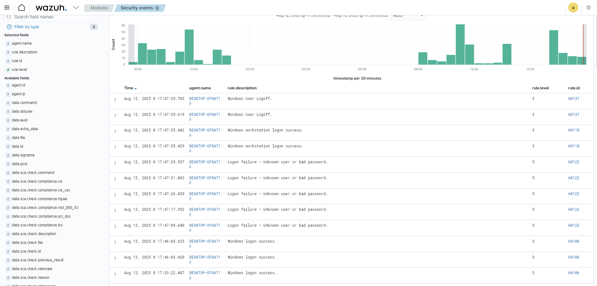

# Cenário 02 — Falhas de login no Windows (Event ID 4625)

**Objetivo:** gerar falhas de autenticação no Windows e validar a detecção pelo Wazuh.

**Ambiente:** Wazuh Server (Ubuntu) + Agente Windows 10.

---

## Como reproduzir

1. **Bloquear a tela**
   - Pressione `Win + L` para ir para a tela de login.

2. **Gerar falhas**
   - Digite uma senha errada para o seu usuário (3 a 5 vezes seguidas).
   - Opcional: tente um usuário inexistente via `Ctrl + Alt + Del` → **Trocar usuário**.

3. **Logar normalmente**
   - Entre com a senha correta para retornar à área de trabalho.

---

## O que esperar no Wazuh

- **Event ID 4625** (falha de logon): *Unknown user or bad password*.
- Campos úteis: `win.system.eventID`, `win.eventdata.TargetUserName`, `win.eventdata.LogonType`, `srcip` (quando houver).

**Filtro rápido (Security events):**

agent.name:"windows" AND win.system.eventID:4625

**MITRE ATT&CK:** T1110 (Brute Force).

---

## Evidências

---

## Ações de resposta sugeridas

- Configurar política de bloqueio de conta (Account Lockout Policy).
- Revisar contas e credenciais fracas.
- Correlacionar eventos de falha (4625) com logons bem-sucedidos (4624) logo após, para identificar acessos suspeitos.

