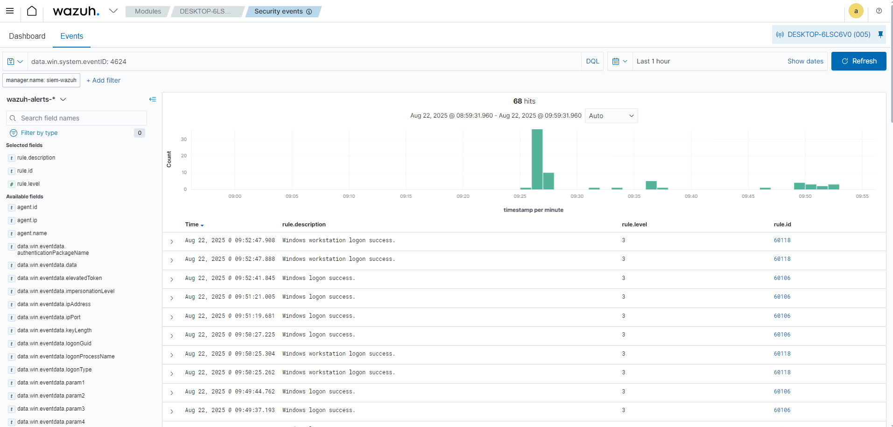

# Cenário 03 — Bloqueio/Desbloqueio de Sessão no Windows (Win+L)

## 🎯 Objetivo
Validar se o Wazuh coleta corretamente os eventos de logon, logoff e lock/unlock do Windows quando a estação de trabalho é bloqueada e desbloqueada.

---

## 🛠️ Passos executados
1. Pressionei `Win + L` para bloquear a estação.  
2. Digitei a senha para desbloquear a sessão.  

---

## 📊 Eventos coletados

**EventIDs registrados (canal Security):**
- **4624** → Logon bem-sucedido  
- **4634** → Logoff  
- **4800** → Workstation locked  
- **4801** → Workstation unlocked  

No Wazuh Dashboard, os eventos foram exibidos com as seguintes descrições:
- *Windows workstation logon success*  
- *Windows logon success*  
- *Windows user logoff*  

📸 **Evidência**  


---

## 🔎 Consultas no Wazuh (DQL) + Explicação

```dql
# Filtrar pelo agente Windows
agent.name:"WIN10-LAB"

# Logon/Logoff
data.win.system.eventID:(4624 OR 4634)

# Lock/Unlock
data.win.system.eventID:(4800 OR 4801)

# Explicação
O bloqueio e desbloqueio da estação geraram eventos de segurança capturados pelo agente do Wazuh
e enviados ao servidor. Esses eventos são importantes em operações de SOC, pois permitem:

- Monitorar acessos em horários incomuns
- Detectar tentativas de login suspeitas
- Validar sessões de usuário legítimas

Resultado: O Wazuh SIEM foi capaz de identificar e classificar corretamente
os eventos de bloqueio e desbloqueio de sessão no Windows.
