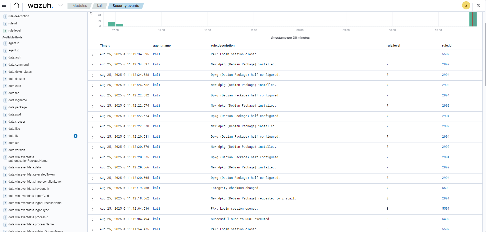

# Cenário 04 — Monitoramento de Atividades no Kali Linux

## 🎯 Objetivo  
Validar a coleta de eventos do agente Wazuh instalado no Kali Linux, monitorando **sessões PAM**, **uso de sudo** e **instalação de pacotes (dpkg)**.

---

## 🛠️ Passos executados  
1. Abertura e fechamento de sessão no Kali (`login/logout`).  
2. Execução de comandos com `sudo`, incluindo acesso root.  
3. Instalação de pacotes com o `apt` (ex.: `htop`).  

---

## 📊 Eventos coletados  

**Eventos registrados pelo Wazuh Dashboard (Agente: `kali`):**  
- **PAM: Login session opened** → abertura de sessão.  
- **PAM: Login session closed** → encerramento de sessão.  
- **Successful sudo to ROOT executed** → uso de sudo com sucesso.  
- **New dpkg (Debian Package) installed / half configured / requested to install** → registro de pacotes instalados e configurados.  
- **Integrity checksum changed** → modificação detectada em integridade de arquivos do sistema.  

---

## 📷 Evidência  

---

📌 **Resultado:** o agente no **Kali Linux** está ativo e enviando logs de autenticação, comandos privilegiados e gestão de pacotes para o Wazuh Server, garantindo visibilidade sobre atividades críticas do sistema.
