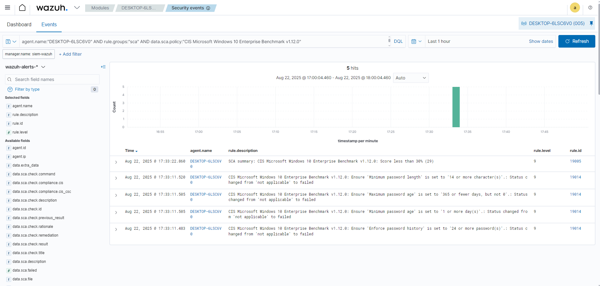

# Auditoria de Políticas de Senha - CIS Benchmark

O Wazuh possui o módulo **SCA (Security Configuration Assessment)**, que permite auditar sistemas a partir de benchmarks de segurança como o **CIS Microsoft Windows 10 Enterprise Benchmark v1.12.0**.  

No experimento abaixo, o agente Windows foi analisado e as seguintes verificações de políticas de senha **falharam**:

- Comprimento mínimo de senha (`Minimum password length`)
- Idade máxima de senha (`Maximum password age`)
- Idade mínima de senha (`Minimum password age`)
- Histórico de senhas (`Enforce password history`)

Essas falhas indicam que a configuração atual não atende às recomendações de segurança do **CIS Benchmark**, reduzindo a resiliência contra ataques de força bruta e uso de credenciais fracas.

## Query utilizada

```dql
agent.name:"DESKTOP-6LSC6V0" AND rule.groups:"sca" AND data.sca.policy:"CIS Microsoft Windows 10 Enterprise Benchmark v1.12.0"

