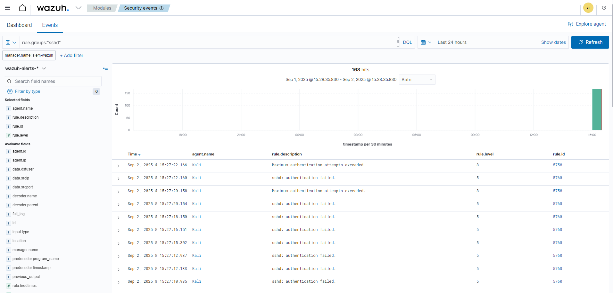

# Cenário 06 — Brute Force SSH Automatizado no Kali Linux

## 🎯 Objetivo
Simular um ataque de brute force SSH automatizado contra o usuário `kali` no próprio Kali Linux e validar a detecção pelo Wazuh SIEM.

---

## 🛠️ Passos da Simulação

1) Verificar se o serviço SSH está ativo no Kali  
   Comando: sudo systemctl status ssh

2) Descompactar a wordlist rockyou.txt (se ainda estiver .gz)  
   Comando: sudo gzip -d /usr/share/wordlists/rockyou.txt.gz

3) Executar o brute force com Hydra contra o localhost  
   Comando: hydra -l kali -P /usr/share/wordlists/rockyou.txt ssh://127.0.0.1 -t 2  
   Observações:  
   - -l kali → usuário alvo  
   - -P → wordlist de senhas  
   - -t 2 → menos tarefas paralelas para evitar bloqueios de conexão  
   - Interrompa após algumas dezenas de tentativas (CTRL + C) — já gera eventos suficientes no auth.log

4) Validar no Wazuh Dashboard (Security events)  
   Filtro sugerido: rule.groups:"sshd" AND agent.name:"Kali"

---

## 📊 Resultados Esperados
- Eventos de falha de autenticação SSH (sshd: authentication failed)  
- Alerta de tentativas excedidas (Maximum authentication attempts exceeded)  
- Severidade variando entre nível 5 (falhas) e nível 8 (brute force)  
- Eventos centralizados e pesquisáveis no Wazuh Dashboard

---

## 📷 Evidência

Arquivo da imagem sugerido: docs/03-simulacoes/wazuh_kali_bruteforce.png

---

## ✅ Conclusão
O Wazuh SIEM detectou múltiplas falhas de login SSH geradas pelo Hydra no Kali Linux, demonstrando a capacidade do SIEM em identificar ataques de brute force em tempo real, uma ocorrência comum em ambientes monitorados por SOC.
