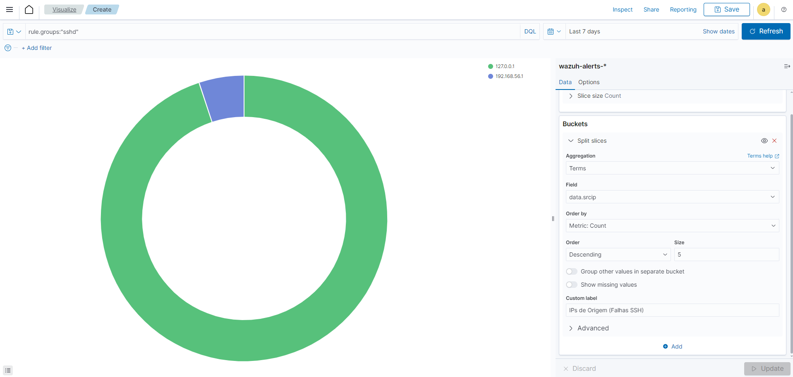
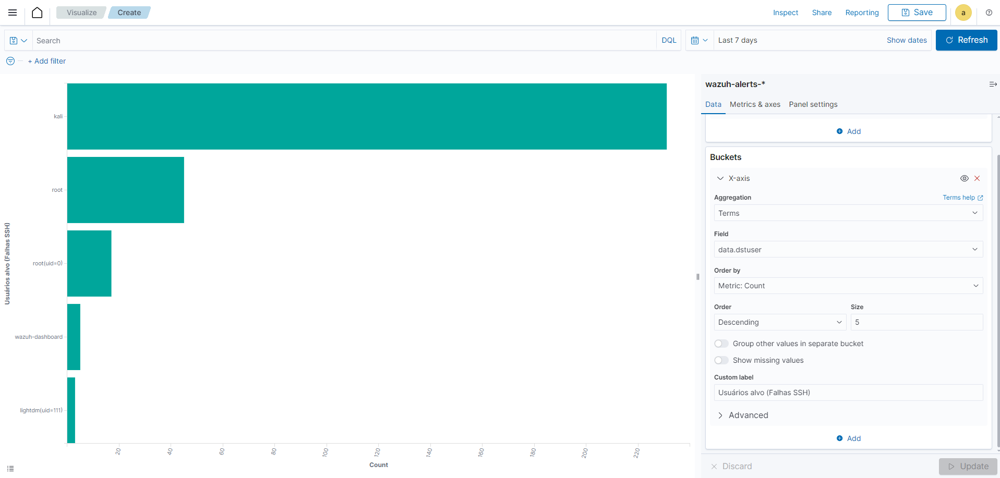
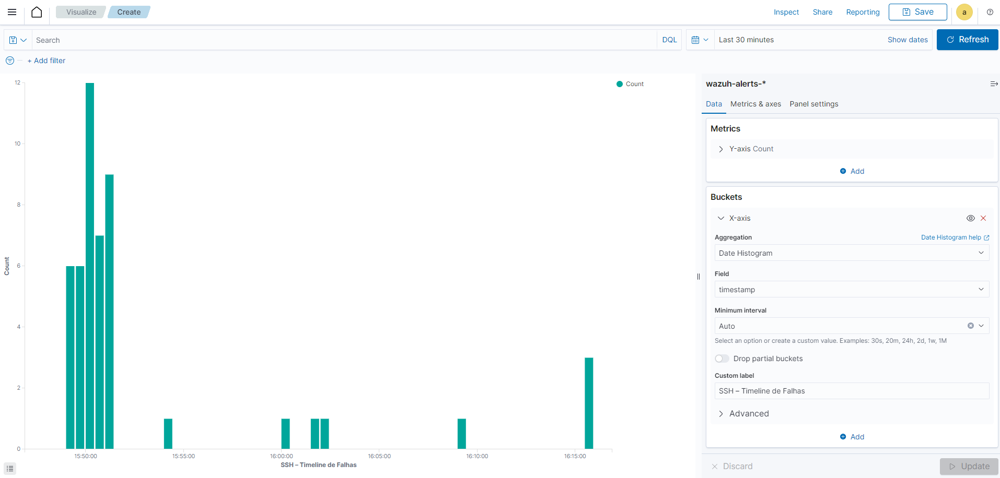
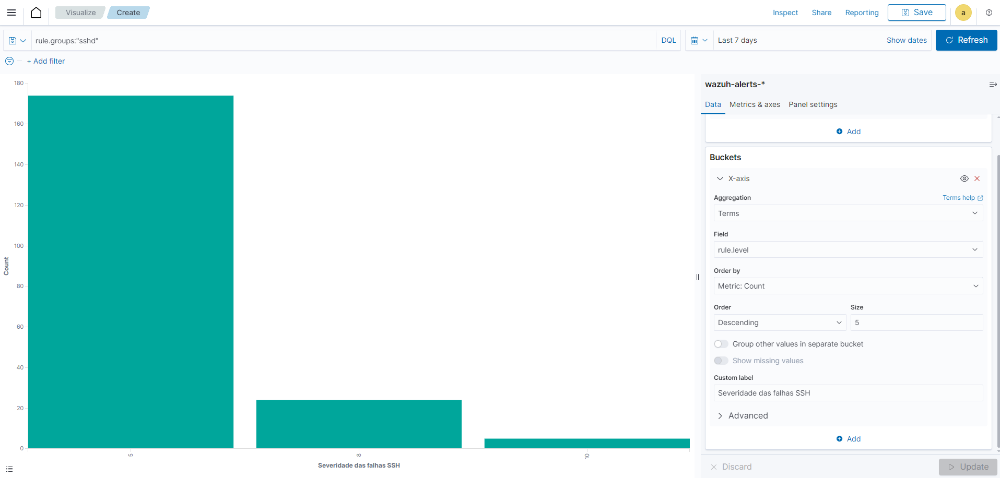

# Cenário 07 — Dashboard de Autenticação SSH

## 🎯 Objetivo
Criar um **Dashboard de Autenticação** no Wazuh/Kibana para centralizar a análise de eventos SSH, utilizando diferentes visualizações (IPs, usuários, timeline e severidade).

---

## 🛠️ Passos da Simulação
1. Gerar eventos de falhas de login SSH no Kali Linux utilizando Hydra (localhost `127.0.0.1`).  
2. Realizar tentativas de login via **Git Bash no Windows** contra o Kali para obter outro IP de origem (`192.168.56.1`).  
3. Configurar visualizações personalizadas no Wazuh/Kibana a partir do índice `wazuh-alerts-*`.  
4. Salvar as visualizações e consolidar em um dashboard único.

---

## 📊 Visualizações Criadas

### 🔹 1. Top IPs de Origem (Falhas SSH)
Mostra os IPs que mais geraram falhas de autenticação SSH.  
**Campo:** `data.srcip`  
**Filtro:** `rule.groups:"sshd"`  

📸 Evidência:  

---

### 🔹 2. Top Usuários Alvo (Falhas SSH)
Mostra os usuários mais visados em tentativas de login via SSH.  
**Campo:** `data.dstuser`  
**Filtro:** `rule.groups:"sshd"`  

📸 Evidência:  

---

### 🔹 3. Timeline de Falhas SSH
Mostra a evolução temporal das falhas de login SSH, evidenciando picos de atividade.  
**Campo:** `@timestamp` (Date Histogram)  
**Filtro:** `rule.groups:"sshd"`  

📸 Evidência:  

---

### 🔹 4. Severidade das Falhas SSH
Distribuição dos eventos por nível de severidade, permitindo diferenciar falhas simples de brute force.  
**Campo:** `rule.level`  
**Filtro:** `rule.groups:"sshd"`  

📸 Evidência:  

---

## ✅ Conclusão
O Dashboard de Autenticação SSH consolida diferentes perspectivas sobre os eventos de login mal sucedido:  
- **IPs de Origem** → de onde vêm as tentativas.  
- **Usuários Alvo** → quem é mais visado.  
- **Timeline** → quando ocorrem os ataques.  
- **Severidade** → classificação da gravidade.  

Esse cenário mostra como o **Wazuh SIEM**, aliado ao Kibana, pode fornecer ao Analista de SOC uma visão clara e centralizada de ataques de autenticação, reforçando a capacidade de detecção em tempo real.

---
